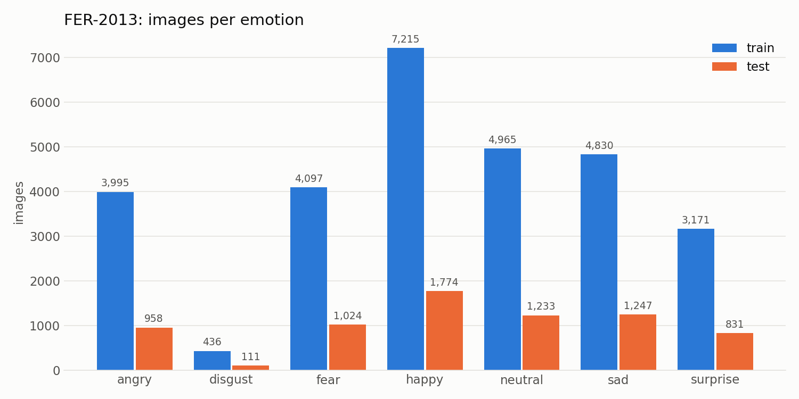
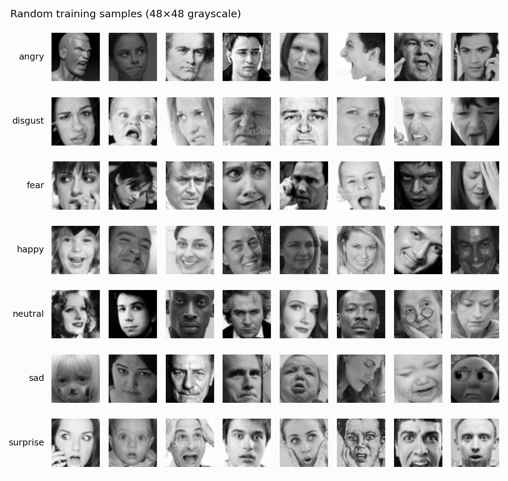
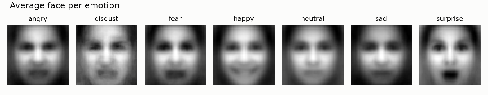
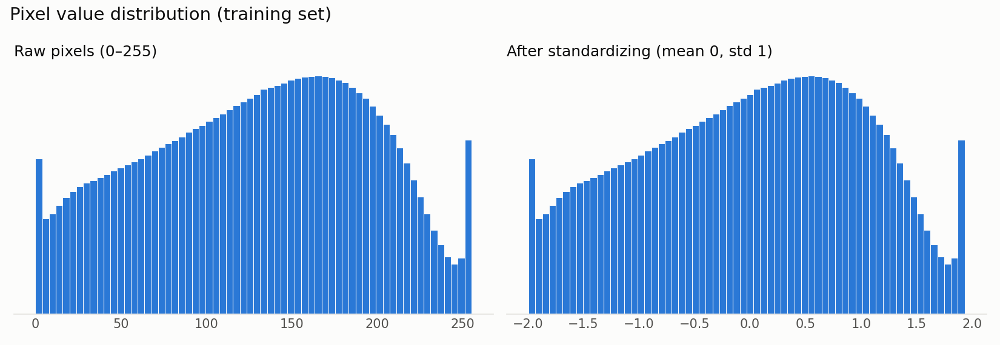

# emotionDetecter

Facial emotion recognition trained on the [FER-2013](https://www.kaggle.com/datasets/msambare/fer2013) dataset — 48×48 grayscale faces, 7 emotions: angry, disgust, fear, happy, sad, surprise, neutral.

> 🚧 Work in progress — built step by step.

## Setup

```bash
python3 -m venv .venv
source .venv/bin/activate
pip install -r requirements.txt
```

## Dataset

The dataset is **not** included in this repo. To download it:

1. Create a Kaggle API token at <https://www.kaggle.com/settings> → *API* → *Create New Token*.
2. Save it outside the repo:
   ```bash
   mkdir -p ~/.kaggle && echo YOUR_TOKEN > ~/.kaggle/access_token && chmod 600 ~/.kaggle/access_token
   ```
3. Run:
   ```bash
   python scripts/download_data.py
   ```

The images land in `data/fer2013/{train,test}/<emotion>/`.

## Data at a glance

```bash
python scripts/explore_data.py
```

35,887 face images (48×48 grayscale) across 7 emotions. The classes are **heavily imbalanced** — `happy` has ~16× more training images than `disgust`:



Random samples from each class:



Averaging every training image per emotion already reveals the signal a model has to learn — the open mouth of *surprise*, the smile of *happy*:



## Preprocessing

```bash
python scripts/preprocess.py
```

- **Split:** 10% of the training set is held out as a stratified *validation* set → train 25,837 / val 2,872 / test 7,178. The test set is not touched until final evaluation.
- **Normalize:** pixels are scaled to 0–1, then standardized with the *training* mean/std (0.508 / 0.255) so no information leaks from val/test.
- **Class weights:** inverse-frequency weights counter the imbalance — `disgust` gets 9.4×, `happy` 0.57×.



## Model

```bash
python scripts/model_summary.py
```

A VGG-style CNN in [`src/model.py`](src/model.py) — **4.8M parameters (~19 MB)**. Each block is `conv3×3 → BatchNorm → ReLU` ×2 → `MaxPool` → `Dropout`, doubling channels while halving resolution:

```
1×48×48 → 64×24×24 → 128×12×12 → 256×6×6 → 512×3×3 → global avg pool → 256 → 7
```

Trains on the Apple Silicon GPU (MPS) when available, falling back to CUDA or CPU.

## Roadmap

- [x] 1. Project skeleton
- [x] 2. Download dataset
- [x] 3. Explore the data
- [x] 4. Preprocessing
- [x] 5. CNN model
- [ ] 6. Training
- [ ] 7. Evaluation
- [ ] 8. Improvements (augmentation, tuning)
- [ ] 9. Live webcam demo
- [ ] 10. Polish & results
