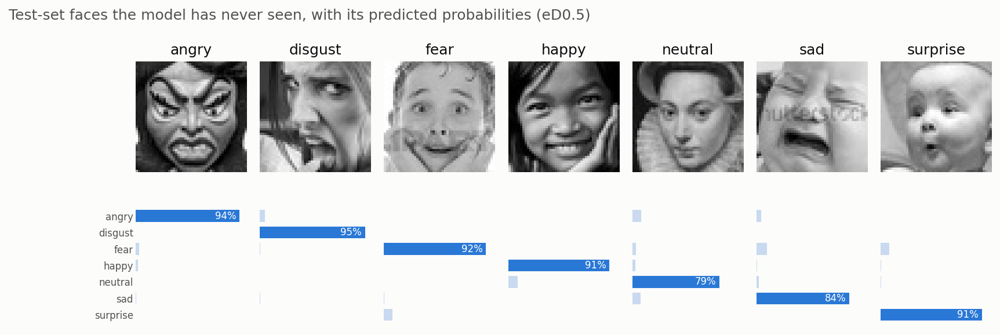
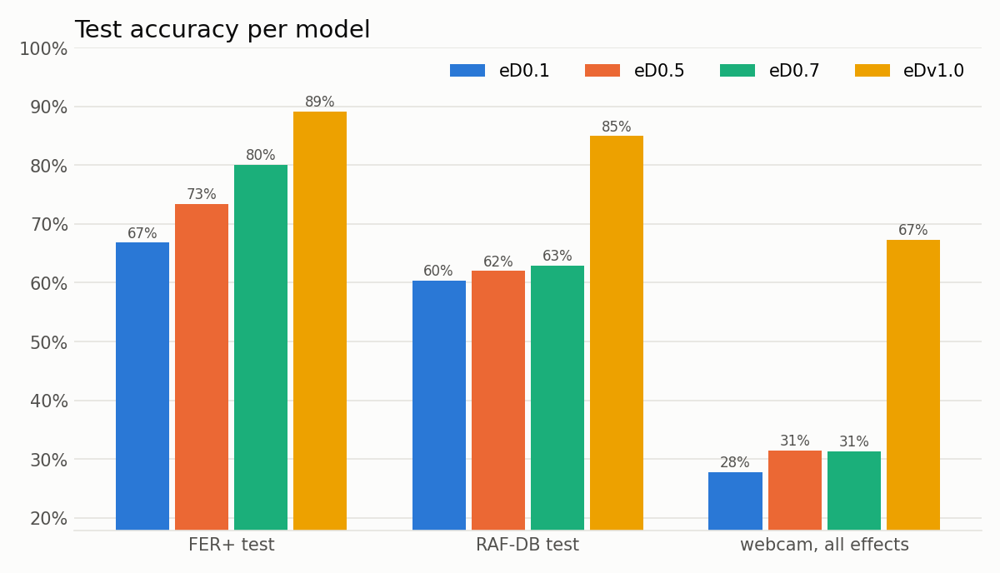
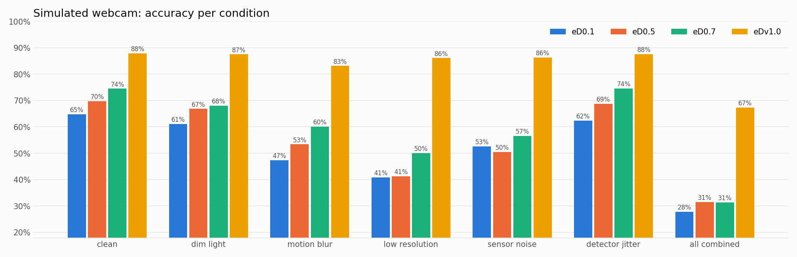
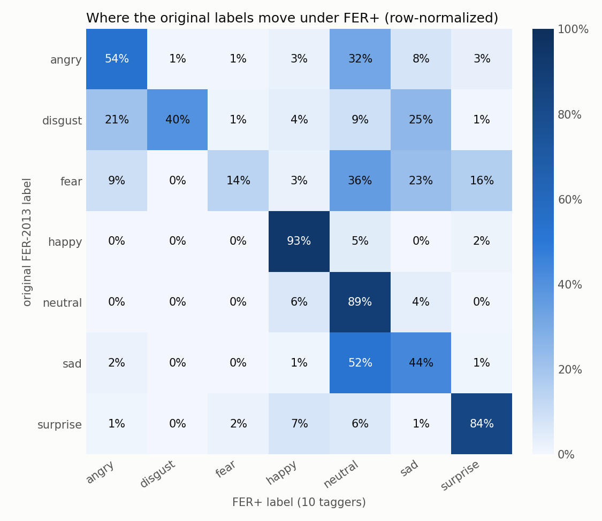

# 🎭 emotionDetecter

[](https://www.python.org/)
[](https://pytorch.org/)
[](https://tegemenozyurek.github.io/emotionDetecter/)
[](https://github.com/microsoft/FERPlus)
[](LICENSE)

**Real-time facial emotion recognition with CNNs trained from scratch.** Turn on your webcam or drop a photo: every face is found, aligned and classified as angry, disgusted, afraid, happy, neutral, sad or surprised, entirely in your browser.

### ▶ [Try it live in your browser](https://tegemenozyurek.github.io/emotionDetecter/)

Nothing to install. Your camera feed never leaves your device: face detection and the model both run locally in the browser (Chrome or Edge recommended for WebGPU).



## Results

Every model tested on the same faces. FER+ test: 6,323 faces with [FER+](https://github.com/microsoft/FERPlus) labels. RAF-DB test: 3,068 real-world faces. Simulated webcam: both test sets with dim light, motion blur, low resolution, sensor noise and detector jitter applied all at once.

| model | what changed | trained on | training time | FER+ test | RAF-DB test | simulated webcam |
|---|---|---|---:|---:|---:|---:|
| `eD0.1` | baseline | 25,837 FER-2013 images | 39 min | 66.8% | 60.4% | 27.8% |
| `eD0.5` | + data augmentation | 25,837 FER-2013 images | 53 min | 73.4% | 62.0% | 31.4% |
| `eD0.7` | + cleaner labels | 22,447 FER+ images | 40 min | 80.1% | 62.9% | 31.4% |
| **`eDv1.0`** | **+ RAF-DB, alignment, webcam training, teachers** | **36,960 FER+ & RAF-DB images** | **4 h 37 min**\* | **89.2%** | **84.9%** | **67.3%** |

\* 1 h 6 min + 1 h 34 min for the two teacher models, 1 h 57 min for `eDv1.0` itself. All times are on a MacBook Air with an Apple M4 chip, using its built-in GPU (PyTorch MPS).



The FER+ test is the fairest comparison: no model trained on those faces' distribution more than another. `eDv1.0` has an advantage on the other two: it trained on RAF-DB's training split, and with augmentations similar to the webcam effects. That advantage is the point (it is what makes the live demo work), but keep it in mind when reading those columns.

## What's different between the models

**`eD0.x`** share one 4.8M-parameter CNN on 48×48 faces; only the training data changes:

- **`eD0.1`: baseline.** Raw FER-2013. It memorized the training faces (87% train vs 64% validation).
- **`eD0.5`: data augmentation.** Random flips, rotations, shifts, zooms and erased patches stop the memorizing: **+6.6 points**.
- **`eD0.7`: cleaner labels.** About a third of FER-2013's labels are wrong; [FER+](https://github.com/microsoft/FERPlus) had 10 people vote on every image: **another +6.7 points**.

**`eDv1.0`** (the *v* stands for video) is built for the live webcam:

- **More and more varied data.** Adds [RAF-DB](http://www.whdeng.cn/raf/model1.html): 15k real-world faces of all ages and ethnicities. FER+ faces the voters disagreed on are kept, with their vote shares as soft labels. *Disgust* goes from 119 to ~1,000 training images, *fear* from 532 to ~1,200.
- **Aligned faces.** MediaPipe (the same detector the web app uses) finds eyes, nose and mouth in every training image, and each face is rotated and scaled onto one template. Live, webcam faces are cut out with the exact same math, so the model sees what it was trained on.
- **Webcam-style training.** Blur, motion blur, low resolution, dim light, sensor noise and detector jitter are simulated during training.
- **Learns from other models.** Two larger teacher networks (a ResNet and a VGG, each trained from scratch, 86.1% and 85.5% validation accuracy) were trained first. `eDv1.0` (an 11M-parameter ResNet on 64×64 faces) learns from their combined predictions as well as from the human labels, and ends up better than both: 87.6% validation, 89.2% FER+ test. `eD0.7` was offered as a third teacher, but the validation search gave it zero weight.

The biggest gains are on the rare emotions and on real-world faces:

| recall (both test sets) | `eD0.1` | `eD0.5` | `eD0.7` | `eDv1.0` |
|---|---:|---:|---:|---:|
| happy | 83.0% | 84.0% | 85.8% | **94.6%** |
| surprise | 62.3% | 67.6% | 65.3% | **91.2%** |
| neutral | 52.9% | 64.7% | 83.5% | **86.3%** |
| angry | 65.8% | 72.3% | 72.0% | **85.2%** |
| sad | 62.3% | 59.3% | 48.9% | **81.2%** |
| disgust | 12.9% | 21.3% | 14.9% | **65.8%** |
| fear | 47.9% | 48.9% | 52.1% | **63.5%** |



## Quickstart

Or run the same demo locally. The trained models are included, so no dataset is needed:

```bash
git clone https://github.com/tegemenozyurek/emotionDetecter.git
cd emotionDetecter
python3 -m http.server -d web 8000      # then open http://localhost:8000
```

The web app ([`web/`](web/)) runs entirely in the browser: MediaPipe finds the faces, each face is aligned, and the model runs with ONNX Runtime Web on the GPU (WebGPU, about 7 ms per face, with a WASM fallback). Faces are tracked between frames and their scores smoothed, so the label does not flicker. No image or video leaves your device. Hover a model name to see what changed; turn on *Model input* to see the aligned face the model receives.

<details>
<summary>Python app (Gradio, eD0.x models)</summary>

```bash
python3 -m venv .venv && source .venv/bin/activate
pip install -r requirements.txt
python app.py        # open http://127.0.0.1:7860
```

The original Gradio app uses OpenCV's Haar face detector and runs the 48×48 `eD0.x` models. `eDv1.0` needs MediaPipe alignment and runs in the web app.

</details>

## How it was built

Each step is one script that prints its results and saves a chart.

| step | script | what happened |
|---|---|---|
| 1. Data | [`download_data.py`](scripts/download_data.py) | 35,887 grayscale 48×48 faces, 7 emotions. *Happy* has 16× more images than *disgust* ([chart](assets/class_distribution.png)). |
| 2. Explore | [`explore_data.py`](scripts/explore_data.py) | Averaging every face per emotion already shows the smile of *happy* and the open mouth of *surprise* ([chart](assets/average_faces.png)). |
| 3. Preprocess | [`preprocess.py`](scripts/preprocess.py) | 10% validation split, normalization, class weights for rare emotions ([chart](assets/preprocessing.png)). |
| 4. Model | [`model.py`](src/model.py) | VGG-style CNN: 4 conv blocks, 1×48×48 → 512×3×3 → 7 emotions. |
| 5. Train | [`train.py`](scripts/train.py) | `eD0.1`: 40 epochs on an Apple M4 GPU. Clear overfitting ([chart](assets/eD0.1/training_curves.png)). |
| 6. Evaluate | [`evaluate.py`](scripts/evaluate.py) | 65.8% on the original test set. Many "mistakes" were actually wrong labels ([examples](assets/eD0.1/predictions.png)). |
| 7. Augment | [`augment.py`](src/augment.py) | `eD0.5`: random distortions remove overfitting ([preview](assets/augmentation.png), [chart](assets/eD0.5/training_curves.png)). |
| 8. Robustness | [`robustness.py`](scripts/robustness.py) | Test on tilted, shifted and covered faces: augmentation makes the model far more stable. |
| 9. Clean labels | [`prepare_ferplus.py`](scripts/prepare_ferplus.py) | Matched every image to its FER+ votes. **32% of labels changed** ([examples](assets/ferplus/relabeled_examples.png)). `eD0.7` trained on them. |
| 10. Keypoints | [`landmarks.html`](tools/landmarks.html) | MediaPipe, run in the browser, found the face in 99.8% of 51,226 FER+ and RAF-DB images. |
| 11. Align | [`align_faces.py`](scripts/align_faces.py) | Every face moved onto one template: eyes level, same size, same position ([before / after](assets/v1/alignment.png)). |
| 12. Dataset v1 | [`prepare_v1.py`](scripts/prepare_v1.py) | FER+ soft labels + RAF-DB: 36,960 training images. |
| 13. Teachers + `eDv1.0` | [`train_v1.py`](scripts/train_v1.py) | Two teachers, then `eDv1.0` distilled from them, all with webcam-style [augmentation](src/augment.py) ([curves](assets/eDv1.0/training_curves.png)). |
| 14. Benchmark + web | [`benchmark.py`](scripts/benchmark.py), [`export_web.py`](scripts/export_web.py) | All models on FER+, RAF-DB and a simulated webcam; export to ONNX, checked against PyTorch. |

Where the original labels move under FER+. Most *fear* and *sad* faces are actually *neutral*:



<details>
<summary>Retrain from scratch</summary>

```bash
# Kaggle token (kaggle.com/settings → API → Create New Token), stored outside the repo
mkdir -p ~/.kaggle && echo YOUR_TOKEN > ~/.kaggle/access_token && chmod 600 ~/.kaggle/access_token

python scripts/download_data.py
python scripts/preprocess.py

# FER+ labels: put fer2013.csv (original FER-2013) and fer2013new.csv
# (github.com/microsoft/FERPlus) in data/ferplus/, then:
python scripts/prepare_ferplus.py

python scripts/train.py --name eD0.8 --augment --epochs 60 --patience 5 --data ferplus
python scripts/evaluate.py --model eD0.8 --data ferplus

# eDv1.0: RAF-DB in data/rafdb/, keypoints from tools/landmarks.html (python tools/landmark_server.py)
python scripts/align_faces.py
python scripts/prepare_v1.py
python scripts/train_v1.py --name _teachers/T1 --arch resnet --epochs 40
python scripts/train_v1.py --name _teachers/T2 --arch vgg --epochs 40
python scripts/train_v1.py --name eDv1.0 --arch resnet --epochs 60 --teachers _teachers/T1,_teachers/T2,eD0.7
python scripts/benchmark.py
python scripts/export_web.py
```

Every model is saved in its own folder, `models/<version>/` (weights, config, logs, test report), with its charts in `assets/<version>/`.

</details>

## Limitations

- **Fear and disgust are still the weakest emotions** (64% and 66% recall for `eDv1.0`). They remain the rarest in the training data.
- **Simulated webcam is not a real webcam.** The video benchmark degrades still photos; there is no labelled video test set. Try the live demo to judge it yourself.
- **Dataset bias.** FER-2013 and RAF-DB were scraped from the web and are not balanced across age, ethnicity or lighting. This is a learning project, not a tool for judging people.

## Acknowledgements

- **FER-2013:** Goodfellow et al., *Challenges in Representation Learning* (ICML 2013 workshop).
- **FER+:** Barsoum et al., *Training Deep Networks for Facial Expression Recognition with Crowd-Sourced Label Distribution* (2016). Released by Microsoft under MIT.
- **RAF-DB:** Li, Deng and Du, *Reliable Crowdsourcing and Deep Locality-Preserving Learning for Expression Recognition in the Wild* (CVPR 2017). Available for non-commercial research only.
- **MediaPipe** (face detection) and **ONNX Runtime Web** (in-browser inference).

The images and labels belong to their creators and are not redistributed here. Code is released under the [MIT License](LICENSE).
