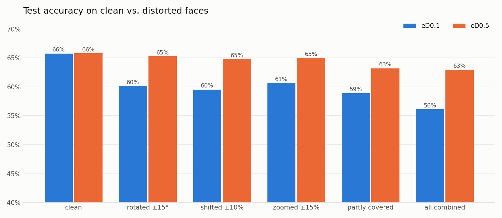
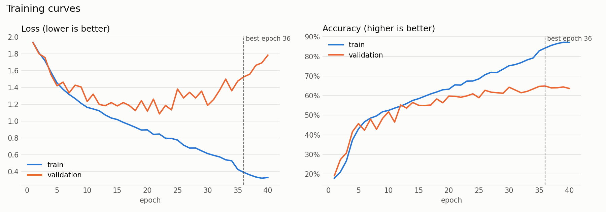
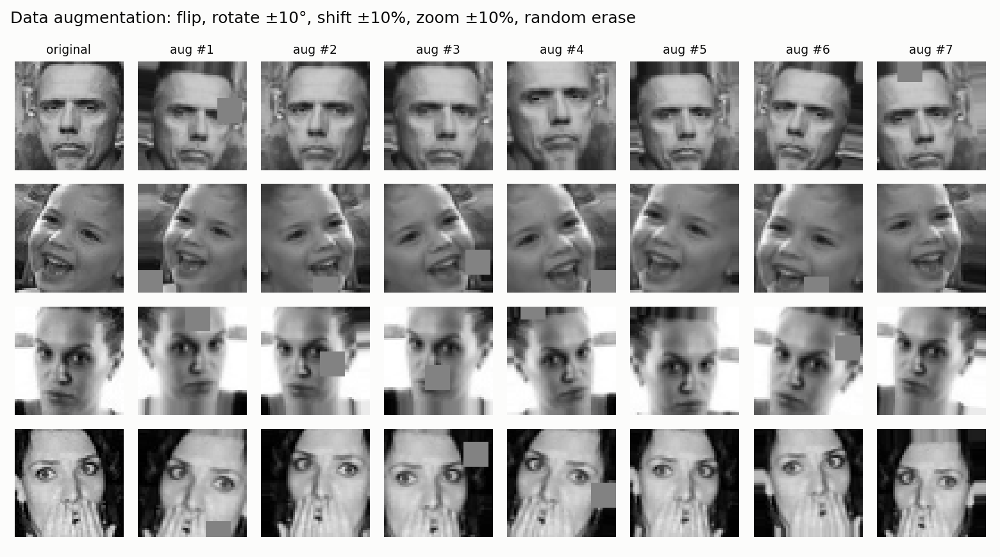
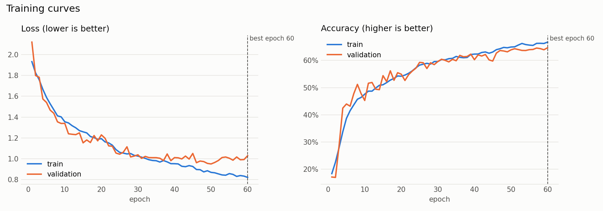

# 😄 emotionDetecter

[](https://www.python.org/)
[](https://pytorch.org/)
[](app.py)
[](https://www.kaggle.com/datasets/msambare/fer2013)
[](LICENSE)

**Real-time facial emotion recognition with a CNN trained from scratch.** Upload a photo or turn on your webcam, and the model finds every face and tells you whether it looks angry, disgusted, afraid, happy, neutral, sad or surprised.


## Highlights

- **65.8% test accuracy on FER-2013**, roughly human-level for this dataset (people agree with the labels ~65% of the time).
- **Robust to real-world faces:** the augmented model `eD0.5` keeps **63%** accuracy on tilted, shifted and partly covered faces, where the baseline drops to 56%.
- **Interactive demo:** a Gradio app with photo upload, live webcam, and a switch between model versions.
- **Small and fast:** 4.8M parameters (19 MB), runs on a laptop CPU. Each version trains in about an hour on an Apple M4.
- **Built step by step:** every stage (data → preprocessing → model → training → evaluation → improvement) is its own script with its own plots, documented [below](#how-it-was-built).

## Quickstart

The trained weights are included, so you can run the demo right after cloning. No dataset or training needed.

```bash
git clone https://github.com/tegemenozyurek/emotionDetecter.git
cd emotionDetecter
python3 -m venv .venv && source .venv/bin/activate
pip install -r requirements.txt
python app.py        # open http://127.0.0.1:7860
```

The app ([`app.py`](app.py)) finds faces with OpenCV's Haar cascade, crops each to 48×48, classifies it, and draws the result on the image with a probability chart. The **Live webcam** tab updates in real time.

## Results

| version | what changed | val acc | test acc | test acc, distorted faces |
|---|---|---:|---:|---:|
| `eD0.1` | baseline CNN, 40 epochs, no augmentation | 64.9% | 65.8% | 56.1% |
| `eD0.5` | + data augmentation, 60 epochs | 64.6% | 65.8% | **63.0%** |



Every version lives in its own folder with its weights, settings, logs and test report:

```
models/<version>/   model.pt · config.json · history.csv · train_log.txt · test_report.txt
assets/<version>/   training_curves.png · confusion_matrix.png · predictions.png
```

## Project structure

```
emotionDetecter/
├── app.py                        # Gradio demo (photo + live webcam, model picker)
├── src/
│   ├── model.py                  # EmotionCNN — 4 conv blocks + classifier head
│   ├── augment.py                # on-GPU augmentation (flip/rotate/shift/zoom/erase)
│   └── predictor.py              # face detection + preprocessing + inference
├── scripts/
│   ├── download_data.py          # 1. fetch FER-2013 from Kaggle
│   ├── explore_data.py           # 2. class balance, samples, average faces
│   ├── preprocess.py             # 3. split, normalize, class weights → .npz
│   ├── model_summary.py          # 4. layer-by-layer summary
│   ├── train.py                  # 5. train a model version
│   ├── evaluate.py               # 6. test-set metrics + confusion matrix
│   ├── preview_augmentation.py   # 7. visualize augmentation
│   ├── robustness.py             # 8. clean vs. distorted comparison
│   └── make_showcase.py          #    README header image
├── models/                       # one folder per trained version
└── assets/                       # all plots
```

## Retrain from scratch

```bash
# 1. Kaggle token (https://www.kaggle.com/settings → API → Create New Token), stored outside the repo:
mkdir -p ~/.kaggle && echo YOUR_TOKEN > ~/.kaggle/access_token && chmod 600 ~/.kaggle/access_token

# 2. Data
python scripts/download_data.py
python scripts/preprocess.py

# 3. Train + evaluate a new version
python scripts/train.py --name eD0.6 --augment --epochs 80 --patience 5
python scripts/evaluate.py --model eD0.6
python scripts/robustness.py
```

The dataset itself is not in this repo. It downloads to `data/fer2013/{train,test}/<emotion>/`.

## How it was built

### Data at a glance

```bash
python scripts/explore_data.py
```

35,887 face images (48×48 grayscale) across 7 emotions. The classes are **heavily imbalanced** — `happy` has ~16× more training images than `disgust`:


Random samples from each class:


Averaging every training image per emotion already reveals the signal a model has to learn — the open mouth of *surprise*, the smile of *happy*:


### Preprocessing

```bash
python scripts/preprocess.py
```

- **Split:** 10% of the training set is held out as a stratified *validation* set → train 25,837 / val 2,872 / test 7,178. The test set is not touched until final evaluation.
- **Normalize:** pixels are scaled to 0–1, then standardized with the *training* mean/std (0.508 / 0.255) so no information leaks from val/test.
- **Class weights:** inverse-frequency weights counter the imbalance — `disgust` gets 9.4×, `happy` 0.57×.


### Model

```bash
python scripts/model_summary.py
```

A VGG-style CNN in [`src/model.py`](src/model.py) — **4.8M parameters (~19 MB)**. Each block is `conv3×3 → BatchNorm → ReLU` ×2 → `MaxPool` → `Dropout`, doubling channels while halving resolution:

```
1×48×48 → 64×24×24 → 128×12×12 → 256×6×6 → 512×3×3 → global avg pool → 256 → 7
```

Trains on the Apple Silicon GPU (MPS) when available, falling back to CUDA or CPU.

### Training

```bash
python scripts/train.py --name eD0.1      # ~40 min on an Apple M4 (MPS)
```

AdamW (lr 1e-3, weight decay 1e-4), class-weighted cross-entropy, batch 128, 40 epochs. The learning rate is halved when validation accuracy plateaus, and the best checkpoint is kept.

**Baseline model `eD0.1`: 64.9% validation accuracy** (epoch 36) — already around human-level on FER-2013 (~65%).



The gap between the curves is classic **overfitting**: training accuracy keeps climbing to 87% while validation stalls around 64% and validation loss rises after epoch ~22. The model is starting to memorize the training faces — step 8 tackles this with data augmentation.

### Evaluation

```bash
python scripts/evaluate.py --model eD0.1 --no-tta
```

`eD0.1` on the held-out **test set (7,178 images): 65.8% accuracy**, macro F1 64.9%.

| emotion | precision | recall | F1 |
|---|---:|---:|---:|
| angry | 58.1% | 58.7% | 58.4% |
| disgust | 71.3% | 69.4% | 70.3% |
| fear | 54.7% | 37.8% | 44.7% |
| happy | 86.4% | 83.0% | 84.7% |
| neutral | 58.1% | 66.7% | 62.1% |
| sad | 51.2% | 58.5% | 54.6% |
| surprise | 78.7% | 80.5% | 79.6% |


- **Happy** and **surprise** are easy — a smile and an open mouth are strong, unambiguous signals.
- **Fear** is the hardest: only 38% recall, often mistaken for *sad* (25%) or *angry* (13%).
- **Sad** is the model's "catch-all" for low-energy negative faces — fear, neutral and angry all leak into it.
- Class weighting paid off for **disgust**: 69% recall despite only 436 training images.


Some "mistakes" are arguably label noise — FER-2013 is known to have mislabeled images.

### Improvement: data augmentation (`eD0.5`)

`eD0.1` memorized its training set (87% train vs 64% val). For `eD0.5`, every training batch is randomly distorted on the GPU ([`src/augment.py`](src/augment.py)): mirrored, rotated ±10°, shifted ±10%, zoomed ±10%, and a random patch is erased. The model never sees the exact same image twice.

```bash
python scripts/preview_augmentation.py
python scripts/train.py --name eD0.5 --augment --epochs 60 --patience 5   # ~55 min
python scripts/evaluate.py --model eD0.5 --no-tta
python scripts/robustness.py
```



Overfitting is gone. Train and validation accuracy now move together, and the best epoch was the last one, so the model was still improving when training stopped:



On the clean test set both versions score **65.8%**. The difference shows up when the test faces are tilted, off-centre or partly covered, which is how faces look in real photos and webcam frames. There `eD0.1` drops by up to 10 points and `eD0.5` stays close to its clean accuracy (see the [Results](#results) chart).

`eD0.5` is the default model in the app.

## Limitations

- **FER-2013 is noisy.** Some labels are wrong (see the smiling "angry" face in the predictions grid), which caps achievable accuracy around 70–75%.
- **Fear is hard.** Recall is only 31–38% depending on the version; it is mostly confused with *sad* and *neutral*.
- **The face detector is the weak link.** The Haar cascade only finds roughly frontal faces and occasionally fires on ears or background. False positives are filtered, but a modern detector (e.g. YuNet) would be more reliable.
- **Dataset bias.** FER-2013 was scraped from the web and is not balanced across age, ethnicity or lighting conditions, so accuracy will vary between people. This is a learning project, not a tool for making decisions about anyone.

## Ideas for next versions

- Train `eD0.5` longer: its best epoch was the last one.
- Swap the Haar cascade for a DNN face detector (YuNet).
- Try transfer learning from a pretrained backbone (e.g. ResNet-18).
- Deploy the demo to Hugging Face Spaces.

## Acknowledgements

FER-2013 was introduced in *Challenges in Representation Learning: A report on three machine learning contests* (Goodfellow et al., 2013) for the ICML 2013 workshop. The images and labels belong to their original creators and are not redistributed here.

## License

Code released under the [MIT License](LICENSE).
