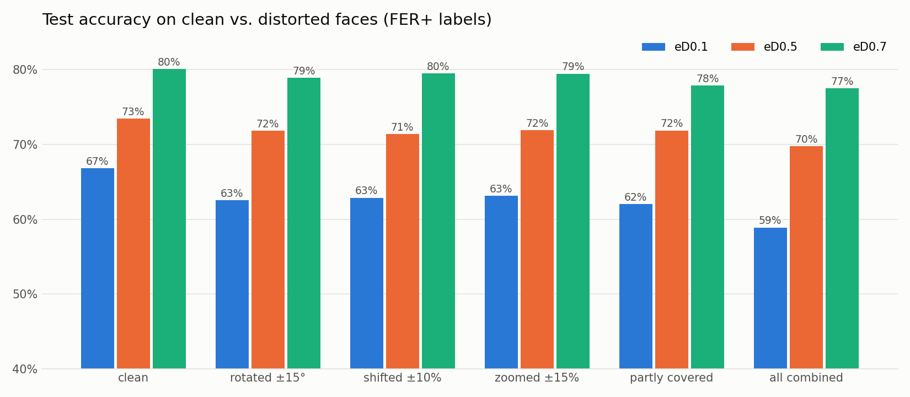

# 😄 emotionDetecter

[](https://www.python.org/)
[](https://pytorch.org/)
[](app.py)
[](https://www.kaggle.com/datasets/msambare/fer2013)
[](LICENSE)

**Facial emotion recognition with a CNN trained from scratch.** Upload a photo or use your webcam. The model finds every face and tells you whether it looks angry, disgusted, afraid, happy, neutral, sad or surprised.


## Results

Three versions of the same network, tested on the same 6,323 faces ([FER+](https://github.com/microsoft/FERPlus) labels):

| model | what changed | trained on | training time | test accuracy | tilted / covered faces |
|---|---|---|---:|---:|---:|
| `eD0.1` | baseline | 25,837 FER-2013 images | 39 min | 66.8% | 58.9% |
| `eD0.5` | + data augmentation | 25,837 FER-2013 images | 53 min | 73.4% | 69.8% |
| `eD0.7` | + cleaner labels | 22,447 FER+ images | 40 min | **80.1%** | **77.5%** |

Training times are for a MacBook Air with an Apple M4 chip, using its built-in GPU (PyTorch MPS). Every model also holds out a validation set (2,872 images for `eD0.1`/`eD0.5`, 2,494 for `eD0.7`) to choose its best epoch; the test faces are never used for training.



## What's different between the models

All three use the same 4.8M-parameter CNN. Only the **training data** changes:

- **`eD0.1`: baseline.** Trained on 25,837 images of the raw FER-2013 dataset. It memorized the training faces (87% train vs 64% validation) and struggles with tilted or off-centre faces.
- **`eD0.5`: data augmentation.** Same 25,837 images, but every training image is randomly flipped, rotated, shifted, zoomed and partly hidden. The model can no longer memorize, so it learns the expression itself: **+6.6 points**.
- **`eD0.7`: cleaner labels.** About a third of FER-2013's labels are wrong. Same recipe as `eD0.5`, but trained on [FER+](https://github.com/microsoft/FERPlus) labels, where 10 people voted on every image. Images the voters could not agree on are dropped, which leaves 22,447 training images, fewer than before but cleaner: **another +6.7 points**. This is the default model in the app.

The biggest gain is on **neutral** faces. The old labels often called calm faces *sad* or *fear*, so the older models refused to say *neutral* (49% recall). `eD0.7` gets 83%.

<details>
<summary>Per-emotion F1 scores</summary>

| emotion | `eD0.1` | `eD0.5` | `eD0.7` | test faces |
|---|---:|---:|---:|---:|
| neutral | 62.2% | 72.4% | **82.1%** | 2,272 |
| happy | 87.7% | **91.2%** | 90.1% | 1,758 |
| surprise | 81.3% | 84.0% | **85.9%** | 811 |
| sad | 46.0% | 51.7% | **56.2%** | 735 |
| angry | 61.1% | 67.2% | **74.2%** | 560 |
| fear | 28.2% | 33.7% | **54.2%** | 145 |
| disgust | 41.4% | 34.9% | **41.8%** | 42 |

</details>

## Quickstart

The trained models are included, so you can try the demo without downloading the dataset or training anything:

```bash
git clone https://github.com/tegemenozyurek/emotionDetecter.git
cd emotionDetecter
python3 -m venv .venv && source .venv/bin/activate
pip install -r requirements.txt
python app.py        # open http://127.0.0.1:7860
```

The app has a **Detect** tab (photo or live webcam) and an **About models** tab that compares the versions. Hover a model name to see what changed.

## How it was built

Each step is one script that prints its results and saves a chart.

| step | script | what happened |
|---|---|---|
| 1. Data | [`download_data.py`](scripts/download_data.py) | 35,887 grayscale 48×48 faces, 7 emotions. *Happy* has 16× more images than *disgust* ([chart](assets/class_distribution.png)). |
| 2. Explore | [`explore_data.py`](scripts/explore_data.py) | Averaging every face per emotion already shows the smile of *happy* and the open mouth of *surprise* ([chart](assets/average_faces.png)). |
| 3. Preprocess | [`preprocess.py`](scripts/preprocess.py) | 10% validation split, normalization, class weights for rare emotions ([chart](assets/preprocessing.png)). |
| 4. Model | [`model.py`](src/model.py) | VGG-style CNN: 4 conv blocks, 1×48×48 → 512×3×3 → 7 emotions. |
| 5. Train | [`train.py`](scripts/train.py) | `eD0.1`: 40 epochs on an Apple M4 GPU. Clear overfitting ([chart](assets/eD0.1/training_curves.png)). |
| 6. Evaluate | [`evaluate.py`](scripts/evaluate.py) | 65.8% on the original test set. Many "mistakes" were actually wrong labels ([examples](assets/eD0.1/predictions.png)). |
| 7. Augment | [`augment.py`](src/augment.py) | `eD0.5`: random distortions remove overfitting ([preview](assets/augmentation.png), [chart](assets/eD0.5/training_curves.png)). |
| 8. Robustness | [`robustness.py`](scripts/robustness.py) | Test on tilted, shifted and covered faces: augmentation makes the model far more stable. |
| 9. Clean labels | [`prepare_ferplus.py`](scripts/prepare_ferplus.py) | Matched every image to its FER+ votes. **32% of labels changed** ([examples](assets/ferplus/relabeled_examples.png)). `eD0.7` trained on them. |

Where the original labels move under FER+. Most *fear* and *sad* faces are actually *neutral*:


<details>
<summary>Retrain from scratch</summary>

```bash
# Kaggle token (kaggle.com/settings → API → Create New Token), stored outside the repo
mkdir -p ~/.kaggle && echo YOUR_TOKEN > ~/.kaggle/access_token && chmod 600 ~/.kaggle/access_token

python scripts/download_data.py
python scripts/preprocess.py

# FER+ labels: put fer2013.csv (original FER-2013) and fer2013new.csv
# (github.com/microsoft/FERPlus) in data/ferplus/, then:
python scripts/prepare_ferplus.py

python scripts/train.py --name eD0.8 --augment --epochs 60 --patience 5 --data ferplus
python scripts/evaluate.py --model eD0.8 --data ferplus
python scripts/robustness.py --data ferplus
```

Every model is saved in its own folder, `models/<version>/` (weights, config, logs, test report), with its charts in `assets/<version>/`.

</details>

## Limitations

- **Rare emotions are weak.** FER+ has only 119 *disgust* and 532 *fear* training images, so these two remain the least reliable classes.
- **The face detector is basic.** OpenCV's Haar cascade only finds roughly frontal faces.
- **Dataset bias.** FER-2013 was scraped from the web and is not balanced across age, ethnicity or lighting. This is a learning project, not a tool for judging people.

## Acknowledgements

- **FER-2013:** Goodfellow et al., *Challenges in Representation Learning* (ICML 2013 workshop).
- **FER+:** Barsoum et al., *Training Deep Networks for Facial Expression Recognition with Crowd-Sourced Label Distribution* (2016). Released by Microsoft under MIT.

The images and labels belong to their creators and are not redistributed here. Code is released under the [MIT License](LICENSE).
