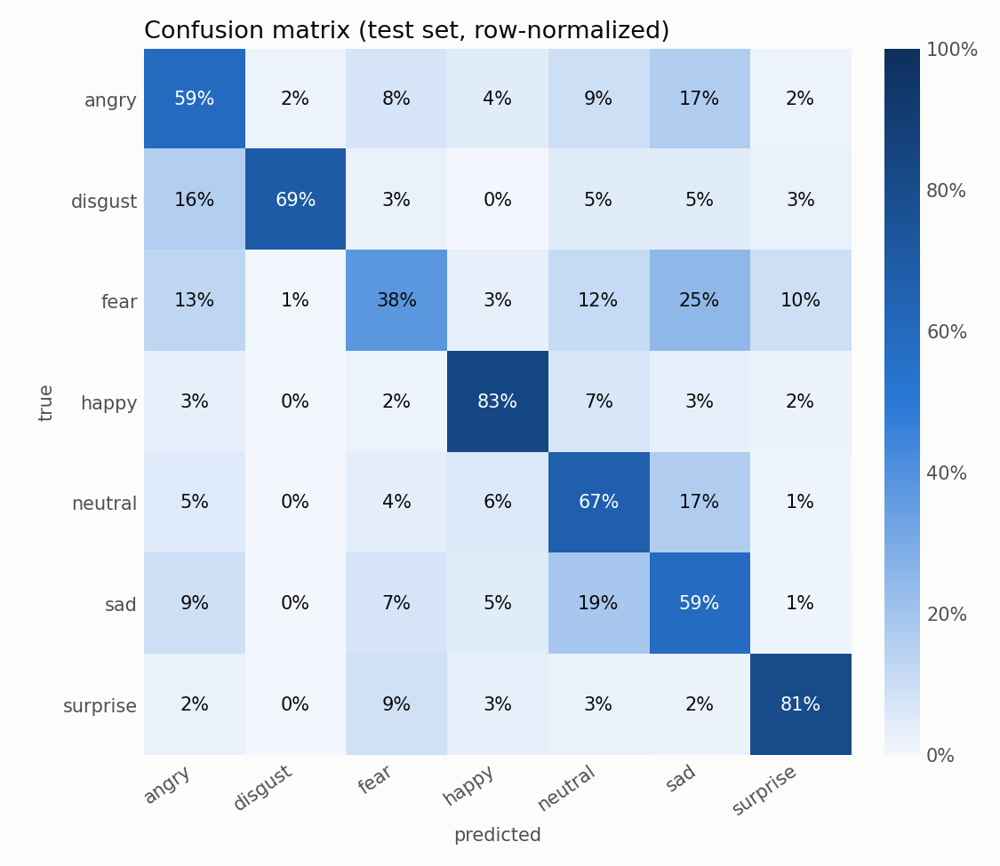
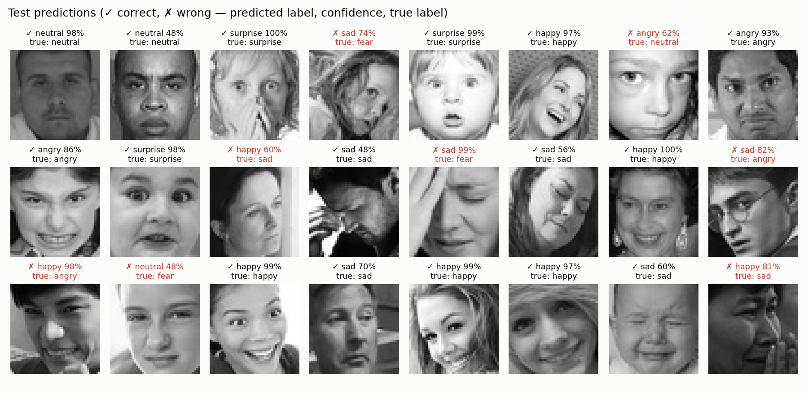

# emotionDetecter

Facial emotion recognition trained on the [FER-2013](https://www.kaggle.com/datasets/msambare/fer2013) dataset — 48×48 grayscale faces, 7 emotions: angry, disgust, fear, happy, sad, surprise, neutral.

> 🚧 Work in progress — built step by step.

## Try it

```bash
python app.py        # then open http://127.0.0.1:7860
```

A Gradio web app ([`app.py`](app.py)): upload a photo, paste one, or use your webcam. Faces are found with OpenCV's Haar cascade, each one is cropped to 48×48 and classified, and the result is drawn on the image with a probability chart for every emotion. The **Live webcam** tab updates in real time.

## Setup

```bash
python3 -m venv .venv
source .venv/bin/activate
pip install -r requirements.txt
```

## Dataset

The dataset is **not** included in this repo. To download it:

1. Create a Kaggle API token at <https://www.kaggle.com/settings> → *API* → *Create New Token*.
2. Save it outside the repo:
   ```bash
   mkdir -p ~/.kaggle && echo YOUR_TOKEN > ~/.kaggle/access_token && chmod 600 ~/.kaggle/access_token
   ```
3. Run:
   ```bash
   python scripts/download_data.py
   ```

The images land in `data/fer2013/{train,test}/<emotion>/`.

## Data at a glance

```bash
python scripts/explore_data.py
```

35,887 face images (48×48 grayscale) across 7 emotions. The classes are **heavily imbalanced** — `happy` has ~16× more training images than `disgust`:


Random samples from each class:


Averaging every training image per emotion already reveals the signal a model has to learn — the open mouth of *surprise*, the smile of *happy*:


## Preprocessing

```bash
python scripts/preprocess.py
```

- **Split:** 10% of the training set is held out as a stratified *validation* set → train 25,837 / val 2,872 / test 7,178. The test set is not touched until final evaluation.
- **Normalize:** pixels are scaled to 0–1, then standardized with the *training* mean/std (0.508 / 0.255) so no information leaks from val/test.
- **Class weights:** inverse-frequency weights counter the imbalance — `disgust` gets 9.4×, `happy` 0.57×.


## Model

```bash
python scripts/model_summary.py
```

A VGG-style CNN in [`src/model.py`](src/model.py) — **4.8M parameters (~19 MB)**. Each block is `conv3×3 → BatchNorm → ReLU` ×2 → `MaxPool` → `Dropout`, doubling channels while halving resolution:

```
1×48×48 → 64×24×24 → 128×12×12 → 256×6×6 → 512×3×3 → global avg pool → 256 → 7
```

Trains on the Apple Silicon GPU (MPS) when available, falling back to CUDA or CPU.

## Training

```bash
python scripts/train.py            # ~40 min on an Apple M4 (MPS)
```

AdamW (lr 1e-3, weight decay 1e-4), class-weighted cross-entropy, batch 128, 40 epochs. The learning rate is halved when validation accuracy plateaus, and the best checkpoint is kept.

**Baseline: 64.9% validation accuracy** (epoch 36) — already around human-level on FER-2013 (~65%).


The gap between the curves is classic **overfitting**: training accuracy keeps climbing to 87% while validation stalls around 64% and validation loss rises after epoch ~22. The model is starting to memorize the training faces — step 8 tackles this with data augmentation.

## Evaluation

```bash
python scripts/evaluate.py
```

On the held-out **test set (7,178 images): 65.8% accuracy**, macro F1 64.9%.

| emotion | precision | recall | F1 |
|---|---:|---:|---:|
| angry | 58.1% | 58.7% | 58.4% |
| disgust | 71.3% | 69.4% | 70.3% |
| fear | 54.7% | 37.8% | 44.7% |
| happy | 86.4% | 83.0% | 84.7% |
| neutral | 58.1% | 66.7% | 62.1% |
| sad | 51.2% | 58.5% | 54.6% |
| surprise | 78.7% | 80.5% | 79.6% |



- **Happy** and **surprise** are easy — a smile and an open mouth are strong, unambiguous signals.
- **Fear** is the hardest: only 38% recall, often mistaken for *sad* (25%) or *angry* (13%).
- **Sad** is the model's "catch-all" for low-energy negative faces — fear, neutral and angry all leak into it.
- Class weighting paid off for **disgust**: 69% recall despite only 436 training images.



Some "mistakes" are arguably label noise — FER-2013 is known to have mislabeled images.

## Roadmap

- [x] 1. Project skeleton
- [x] 2. Download dataset
- [x] 3. Explore the data
- [x] 4. Preprocessing
- [x] 5. CNN model
- [x] 6. Training
- [x] 7. Evaluation
- [ ] 8. Improvements (augmentation, tuning)
- [ ] 9. Live webcam demo
- [ ] 10. Polish & results
